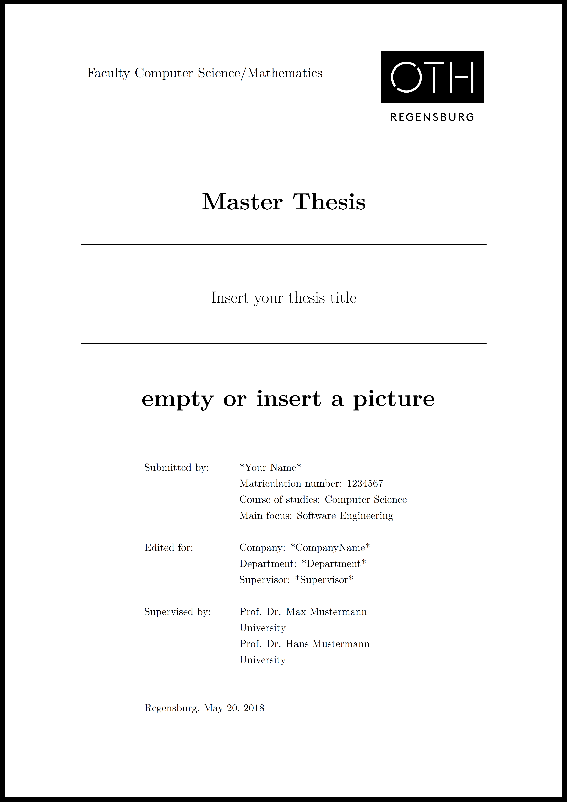

# Thesis templates

A repository for thesis templates with Latex

- [Template 1](https://github.com/bierschi/thesis_templates#template-1)
- [Template 2](https://github.com/bierschi/thesis_templates#template-2)

## Template 1

 
  

 

## Template 2

 
  

 

created with TexMaker:  http://www.xm1math.net/texmaker/

## Usage

-  Download repo
-  Go into `template1`
-  Open `thesis.tex`
-  Press the Button `Quick Build` (TexMaker)
-  Change to `BibTeX` and press the button
-  Change back to `Quick Build` and press the button again
-  PDF output should have been created successfully

## Project Layout
<pre><code>
/template1
    /bibtex
        thesis_bibliography.bib
        unsrtdin.bst
    /chapters
        1_introduction
        2_chapter
        3_chapter
        4_chapter
        5_chapter
    /images
        /chapter1
        /chapter2
        /chapter3
        /chapter4
        /chapter5
        /cover_sheet
        /page_style
    /inputs
        abstract.tex
        appendix.tex
        cover_sheet.tex
        declaration_of_authorship.tex
        list_of_abbreviations.tex
        locking_flag.tex
        packages.tex
        page_style.tex
    /pdf_example
        thesis_template_1.pdf
    thesis.tex

/template2
    /bibtex
        bibtex_thesis.bib
    /chapters
        1_Einleitung.tex
        2_Kapitel.tex
        3_Kapitel.tex
        4_Kapitel.tex
        5_Kapitel.tex
        6_Kapitel.tex
    /images
        /Anhang
        /Kapitel1
        /Kapitel2
        /Kapitel3
        /Kapitel4
        /Kapitel5
        /Kapitel6
        OTH_Regensburg_Logo_aktuell.jpg

    /inputs
        Abstract.tex
        Acronym.tex
        Anhang.tex
        Befehle.tex
        Deckblatt.tex
        Erklaerung.tex
        Glossar.tex
        Meta.tex
        Packages.tex
        Seitenstil.tex
        Sperrvermerk.tex
        Symbolverzeichnis.tex
    /pdf_example
        thesis_template_2.pdf
    thesis.tex

LICENSE
README.md

</pre></code>